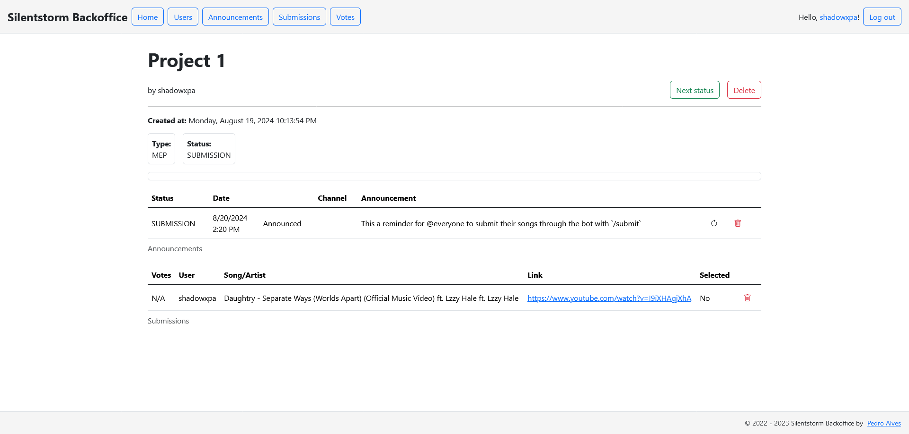
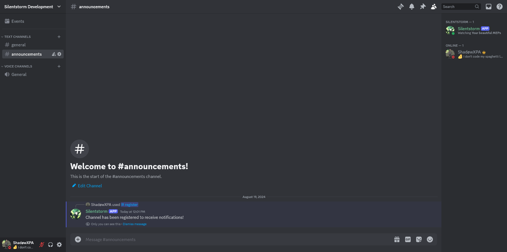
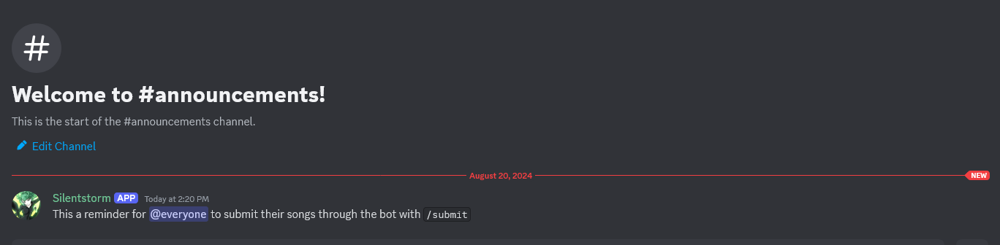

# Silentstorm

Fanvid Studio management tools.

## Backoffice

The backoffice lets you view your projects, create projects, create project announcements, add song submissions, add song votes, manage users, etc.  

## Discord Bot

The discord bot lets you register and unregister channels for announcements, and submit songs for projects.  

## Installation

### Prerequisites

- [.NET Core 6 Runtime](https://dotnet.microsoft.com/en-us/download/dotnet/6.0)
- Without Docker:
  - [MySQL](https://www.mysql.com/)
  - [Lavalink](https://github.com/lavalink-devs/Lavalink) **version 3** ([Deprecated](https://github.com/lavalink-devs/Lavalink/discussions/1100))
- [Docker](https://www.docker.com/) (Optional)

### Run

Download the latest version available on the [Releases](https://github.com/ShadowXPA/Silentstorm/releases/latest) tab.  

### Database and Lavalink

You will need a [MySQL](https://www.mysql.com/) database and [Lavalink](https://github.com/lavalink-devs/Lavalink) **version 3** ([Deprecated](https://github.com/lavalink-devs/Lavalink/discussions/1100)) to run these applications successfully.
If you have [Docker](https://www.docker.com/) installed, there is a `docker-compose.yml` with both MySQL and Lavalink (edit it to your liking).  

### Backoffice

Before running the backoffice application, edit the `backoffice.json` configuration file.  
To run the backoffice, simply run the `Backoffice.exe` (for Windows) or `./Backoffice` (for Linux).  
The application should start on [`https://localhost:5001`](https://localhost:5001).

### Discord Bot

Before running the discord bot, edit the `discordbot.json` configuration file. And do not forget to add your bot's token.  
If you do not have a token, head over to the [Discord Developers](https://discord.com/developers) page, create an application, and on the `Bot`'s tab you can grab a `Token`.
To run the bot, simply run the `DiscordBot.exe` (for Windows) or `./DiscordBot` (for Linux).  

## Future work

This project is lacking in a lot of features, namely security features.
**It is not production ready!**
It is best for personal use, with limited access to the backoffice.  

Below are some features that could be integrated.  

### Backoffice

- Roles (Admin, Member, Editor, etc.)
- Associate members to projects
- Public/Private projects
- Allow members to submit their parts (either a link or a file)
- Profiles for each member, with their public projects
- Pagination on the various pages

### Discord Bot

- Automatic discord role creation
- Automatic discord role assignments
- Join project command
- Submit parts ([unlisted] YouTube links?)
- Automatically create public/private threads for each project
- Alter the submit command to allow for per project song submission
